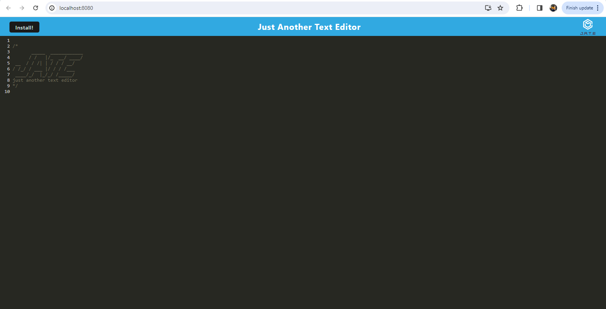

# PWA-Text-Editor

## Description

This app is a single page text editor application that meets the PWA criteria. This application also functions offline. 

## Installation

Run 'npm install' first and then 'npm run build' then 'npm run start:dev'

## Deployment

Could not get this to load fully on Render and not sure what else to do.

https://github.com/G2Squared/PWA-Text-Editor.git
https://pwa-text-editor-q6kh.onrender.com

## License

